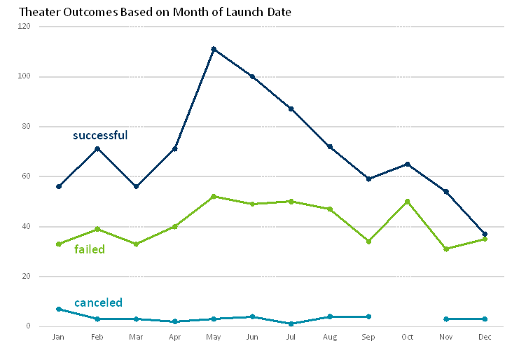

# Kickstarting with Excel

## Overview of Project

### This project had two purposes: 1. To gain more experience with Excel and 2. To analyse the Kickstarter data to give ficticious Louise some insight for her play based on the launch data and funding goals. The analyses looked specifically at the Theater parent category and the plays sub-category.

## Analysis and Challenges

### The first part of the analysis was looking at the number of outcomes vs the launch month. Live outcomes were excluded. The data were summarized in a pivot table to filter for Theater outcomes only. From the pivot table, a line chart was created to look at the relationship of the number of the three outcomes by their launch date.

### Analysis of Outcomes Based on Launch Date
####  There is a peak of successful campaigns in the months of May-July. After that the number of succesful outcomes has a declining trend into December. Failed outcomes also peak in the months of May-August, around 50 per month. The number of canceled outcomes does not seem to have any relationship to the month in which it was launched. Louise's play "Fever" had its goal launched in June so, in theory, it had a good chance of success based on the chart below.  
   

### Analysis of Outcomes Based on Goals
####  The percent of successful outcomes start out relatively high (~80%) with the lowest goal category. As the the amount of the goal increases the success percentage goes down. There are a couple of categories (35,000-45,000) where the success jumps up to almost 70%. Louise's play had a goal of $2,885 where there is a 73% success rate. Based on the chart below, "Fever" should have had a good chance of success.
   

### Challenges and Difficulties Encountered
####  My initial challenges were related to the GitHub and GitLab environments. I'm getting better with those as the class office hours introduce more features and then practice, practice, practice. I didn't have many challenges with the analyses. The instructionas are very detailed for the module and challenge so it's easy to miss small details. When doing the COUNTIFS() calculations, I had to redo it a couple of times to get the exact endpoints for the groups (ie < or <=). It took a bit of Googling and testing to figure out how to insert an image file into the README. There is also a bit of a challenge editing in Markdown without a spellchecker. I have to constantly edit the file looking for misspelled words since they are not highlighted. 

## Results

### Conclusions about the Outcomes based on Launch Date
1. The number of succesful Theater outcomes is higher in the Launch months of May, June, and July (highest in May). 
1. From May to December there is a pretty strong negative trend where number of successful outcomes goes down.
1. The number of canceled outcomes doesn't seem to matter which month in which they were launched.

### Conclusions about the Outcomes based on Goals
1. The percentage of successful outcomes for plays goes down (from ~80% to 20%) as the goal goes up until a blip at 35,000 to 44,999. At those goals the percent successful jumps up to almost 70%.
2. There were no canceled plays at any goal level.

### Limitations of this dataset
####  The data set is pretty well organized with no missing cells. Going forward with these data, I would have to be especially careful summarizing the monetary data across different countries without accounting for different currencies. When looking at the Percentage of Outcomes Based on Goals, it would be good to take the numbers (numerator and denominator) into account. Percentages based on small numbers can change fairly drastically with the addition or substraction of a few numbers. 

####  There is a plethora of other analyses to look at these data. The analyses based on launch data could look over all years. The seasonality may not be the same for each year. Another table and chart could look at days from launch to end vs # of successes. The average donation may also have a relations ship with outcome.It would be interesting to look at more data by country. We only looked at US and GB. There are also many more Parent and SubCategories to explore with the above charts. Every chart could have Louise's play's data incorporated on it as it was to be shared with a client.

